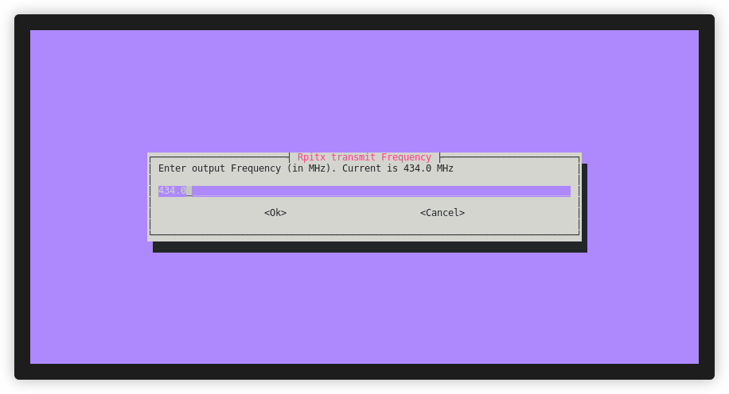

# About rpitx-ui
**rpitx** is a general radio frequency SDR transmitter for Raspberry Pi which can work on frequencies from **5 kHz** up to **1500 MHz**. **rpitx-ui** includes changes to the _./easytest.sh_ script to make it easier to interact with the **rpitx** package via a console user interface.

# Installation process
Update the list of available software packages, download and install **rpitx-ui**.
```sh
sudo apt update
git clone https://github.com/IgrikXD/rpitx-ui
cd rpitx
./install.sh
```

Create a symbolic link to _easytest.sh_ to be able to run _easytest.sh_ from anywhere on the system by running the **rpitx-ui** command.
```sh
sudo ln -s "$PWD/easytest.sh" /usr/local/bin/rpitx-ui
```

Make a reboot in order to use **rpitx-ui** in a stable state.
```sh
sudo reboot
```

# Usage 
Plug a wire (acts as an antenna) on [GPIO 4](https://www.raspberrypi.com/documentation/computers/images/GPIO-Pinout-Diagram-2.png) or use [separate PCB with SMA output](https://github.com/IgrikXD/rpitx-coax-pcb). Using an expansion board will be the best option, as it will allow you to use a coaxial SMA connector to connect radio equipment and an output filter to suppress interference.

Run **rpitx-ui** application:
```sh
rpitx-ui
```

# Differences from the [original rpitx](https://github.com/F5OEO/rpitx) package
You no longer need to run the **./easytest.sh** command from the project directory every time. You can simply run the **rpitx-ui** command, which is a symbolic link to the ./easytest.sh file and allows you to run it from anywhere on the system.  


**easytest.sh** now has a friendlier user interface and allows you to select the specific file you want to use when transferring. The files you need should be added to the **src/resources** directory, after which you will have access to a menu for selecting a specific file when working with the "_**Spectrum**_", "_**FmRds**_", "_**NFM**_", "_**SSB**_", "_**AM**_", "_**FreeDV**_" and "_**SSTV**_" modes. **easytest.sh** selects files of the extension that a specific operating mode requires: for example, for the "FmRds" mode you will be asked to select only _.wav_ files from the list of all files available in the **src/resources** directory, and for the "_**SSTV**_" mode you will be asked to select file with the extension _.jpg_.  


Added the ability to send a custom message when working in the "_**Pocsag**_" and "_**RTTY**_" modes. If you enter an empty message, an error message will be displayed and the transfer will not start, and you will be returned to the main menu.  


Added the ability to specify your call sign when working in "_**Opera**_" mode. If you enter an empty call sign, an error message will be displayed and the transmission will not start, and you will be returned to the main menu.  


Fixed a bug with displaying the "_Bye bye_" message when exiting the program - now it is displayed correctly.

## How to contact me?
- E-mail: igor.nikolaevich.96@gmail.com
- Telegram: https://t.me/igrikxd
- LinkedIn: https://www.linkedin.com/in/igor-yatsevich/