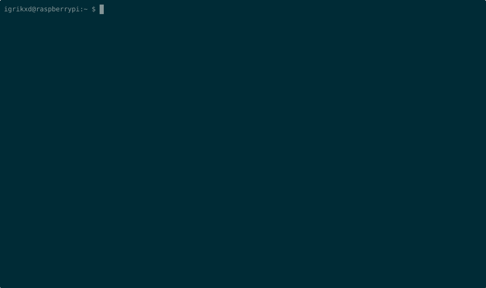
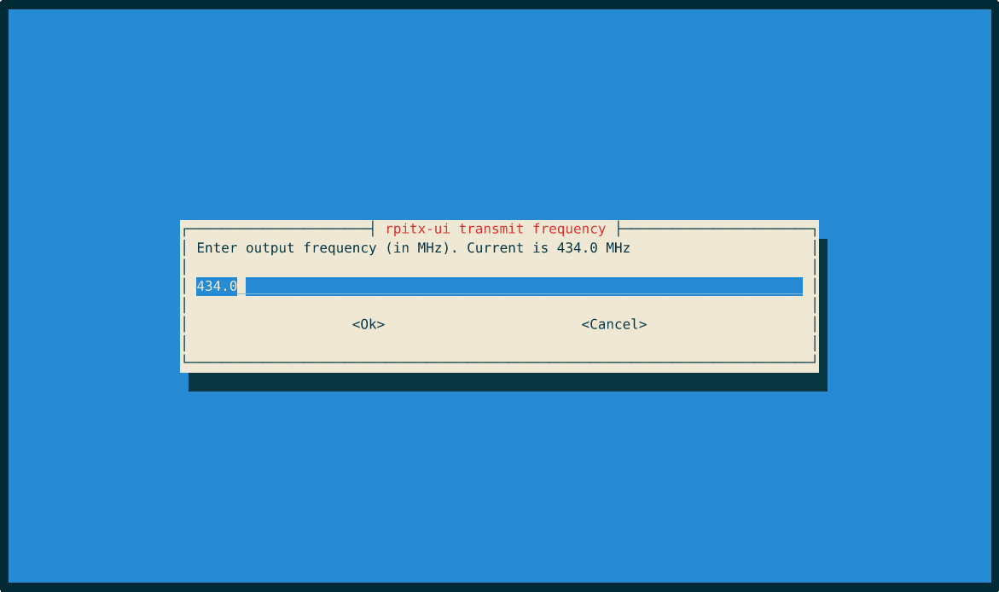

## About rpitx-ui
[rpitx] is a general radio frequency SDR transmitter for Raspberry Pi which can work on frequencies from **5 kHz** up to **1500 MHz**. 

**rpitx-ui** is a modernized fork of [rpitx] that ships a [convenient console user interface](#user-interface-changes), replaces the legacy Makefiles with a modern CMake-based build system, and rewrites most transmitter binaries in modern C++20 around a shared DSP / audio / CLI infrastructure - see [changes to core functionality](#changes-to-core-functionality) for the full list.

The [`install.sh`](./install.sh) script installs all system dependencies, builds `librpitx` (_and optionally `ft8_lib`_) under the local tree, and installs binaries to `/usr/bin` and resource files to `/usr/share/rpitx-ui`, so **rpitx-ui** can be run from any directory without being tied to the cloned repository.

> [!WARNING]
> The current upstream [rpitx] has a `dvb/dvbsenco8.s` build error. **rpitx-ui** is based on [rpitx] commit [cce1fe6](https://github.com/F5OEO/rpitx/commit/cce1fe6acf90d4d34ce304aed48fe80ec4ff51e7), builds cleanly, and is adapted to work on **Raspberry Pi OS (_64-bit, Debian Trixie_)**. Synchronization with upstream is no longer maintained - **rpitx-ui** evolves independently as its own ecosystem focused on fixing upstream bugs and building a modular, reusable architecture.

## Project support
[![BTC: Make a donation][BTC-badge]](https://nowpayments.io/donation/wsprbeacon)&nbsp;[![PayPal: Make a donation][PayPal-badge]](https://www.paypal.com/donate/?hosted_button_id=Q8PRFPXKKSDAQ)&nbsp;[![Revolut: Make a donation][Revolut-badge]](https://revolut.me/iharygxob)

Your support helps me continue developing open-source projects like [WSPR-beacon](https://github.com/IgrikXD/WSPR-beacon) and [Easy-SDR](https://github.com/IgrikXD/Easy-SDR), while also enabling the creation of new tools that benefit the community.

## Current development progress
[![GitHub Actions: rpitx-ui build status][rpitx-ui-build-badge]](https://github.com/IgrikXD/rpitx-ui/actions/workflows/rpitx-ui-build.yml)&nbsp;

## Installation process
Clone the **rpitx-ui** repository:
```sh
git clone https://github.com/IgrikXD/rpitx-ui
cd rpitx-ui
```
Optionally, you can add any resource files you need to the [`src/resources`](./src/resources/) directory before installation. They will be copied to the system resource directory `/usr/share/rpitx-ui` during the installation process.

Install the **rpitx-ui** package:
```sh
./install.sh
```

To build only the core targets used directly by the `rpitx-ui` interface (_skipping optional binaries and the ft8_lib dependency_), use the `--skip-optional` flag:
```sh
./install.sh --skip-optional
```

To run the tests for the shared `audio` / `cli` / `dsp` utility libraries as part of the installation script execution, use the `--enable-testing` flag. A failing test aborts the installation process before any binaries are installed system-wide or the Raspberry Pi boot configuration is modified:
```sh
./install.sh --enable-testing
```

To add new files for transmission after installation, place them directly into `/usr/share/rpitx-ui`. You can override the default resource directory path by setting the `RPITX_RESOURCES_LOCATION` environment variable.

## Uninstallation process
To remove **rpitx-ui** from the system, run the uninstallation script from the project directory:
```sh
./uninstall.sh
```
This will remove all **rpitx-ui** binaries, shell scripts, and resource files. The `csdr` runtime dependency is **not** removed by default, because it may be shared with other SDR projects on the system.

To also remove the `csdr` runtime dependency, use the `--purge-deps` flag:
```sh
./uninstall.sh --purge-deps
```

## Usage
Connect a wire (_acts as an antenna_) to [GPIO 4](https://www.raspberrypi.com/documentation/computers/images/GPIO-Pinout-Diagram-2.png) or use [a separate PCB with SMA output](https://github.com/IgrikXD/rpitx-coax-pcb). Using an expansion board is the best option, as it allows you to use a coaxial SMA connector to connect radio equipment and an output filter to suppress interference.

Run the **rpitx-ui** application:
```sh
rpitx-ui
```

## Differences from the original [rpitx] package

### User interface changes
You no longer need to run the [`./easytest.sh`](./easytest.sh) command from the project directory every time. You can simply run the `rpitx-ui` command from anywhere on the system - during installation, [`./easytest.sh`](./easytest.sh) is copied to `/usr/bin/rpitx-ui` via CMake.  


[`easytest.sh`](./easytest.sh) now has a friendlier user interface and lets you select the specific file used for transmission in the "_**Spectrum**_", "_**WFM**_", "_**NFM**_", "_**SSB**_", "_**AM**_", "_**FreeDV**_" and "_**SSTV**_" modes. The menu filters files by the extension required for the chosen mode:
- "_**WFM**_" / "_**NFM**_" / "_**SSB**_" / "_**AM**_" - any libsndfile-supported audio file (`.aif`, `.aiff`, `.caf`, `.flac`, `.mp3`, `.wav`)
- "_**SSTV**_" - `.jpg`
- "_**FreeDV**_" - `.rf`

After selecting a file, you can choose the playback mode: "_loop_" (_replay continuously_) or "_once_" (_play once and stop at end of file_).  


Added the ability to send a custom message in the "_**Pocsag**_", "_**RTTY**_" and "_**CW**_" modes.  


Added the ability to specify your call sign in "_**Opera**_" mode.  


Added "_**CW**_" mode for Morse code transmission with a custom message and adjustable transmission speed in words per minute (_WPM_).  


Added "_**RFgen**_" mode for wideband RF signal generation. You can choose one of three generator types - "_**Noise**_" (_uniform pseudo-random noise_), "_**Sweep**_" (_fast sawtooth sweep_), or "_**Multitone**_" (_random fast-hopping across equidistant tones_) - then enter the bandwidth in Hz (_and the number of tones for "**Multitone**"_).  


Added NFM deviation-mode selection for the "_**NFM**_" transmitter: "_**Wide**_" (_+-5 kHz deviation for 25 kHz amateur VHF/UHF channels_) or "_**Narrow**_" (_+-2.5 kHz deviation for 12.5 kHz PMR/DMR-style channels_).  


Added SSB sideband selection ("_**USB**_" / "_**LSB**_") for the "_**SSB**_" transmitter, replacing the original [rpitx] hard-coded single-sideband behavior.  


Added RDS parameter setup for the "_**WFM**_" transmitter (_formerly labeled "**FmRds**" in the menu_): RDS Programme Identification (_PI_) code, Programme Service (_PS_) name, RadioText (_RT_), and 50 us / 75 us FM pre-emphasis selection.  


In custom-input modes, required values are validated before transmission starts: empty required fields are rejected, and numeric / mode-specific inputs are additionally checked for malformed or out-of-range values. If validation fails, a clear error message is shown and **the transmission is not started**.

Fixed the "_Bye bye_" exit message not being displayed correctly when leaving the program.

### Changes to core functionality
Most transmit modes have been rewritten from scratch as standalone C++20 binaries that share a common foundation:

- **Audio I/O.** Mono or stereo audio at any libsndfile-supported sample rate is accepted via the shared [`AudioPipeline`](./src/utils/audio/audio_pipeline.h) / [`AudioRateConverter`](./src/utils/audio/audio_rate_converter.h) (_[libsndfile](https://github.com/libsndfile/libsndfile) + [libsoxr](https://github.com/chirlu/soxr/)_), which downmixes and resamples to the rate required by each modulator. The audio source can be either a file `--audio` or stdin `--stdin`, so the binaries can be driven from a live capture or an external DSP chain without intermediate temporary files.
- **CLI.** Argument parsing is delegated to the shared [`cli`](./src/utils/cli/) helpers built on top of [CLI11](https://github.com/CLIUtils/CLI11) (_locale-independent numeric conversion, type-checked option binding, mutually exclusive option groups, uniform help/parse-error reporting_), replacing the legacy `atof` / `strtol` parsing that silently accepted invalid input.
- **Error handling.** Resource construction and the streaming loop are wrapped in `try`/`catch` so failures (_invalid arguments, missing audio file, DMA bring-up errors, runtime DSP errors_) are reported as a single human-readable diagnostic instead of an uncaught exception terminating the process.
- **DMA integration via librpitx.** The new binaries call into `librpitx` (_`iqdmasync`, `amdmasync`, `ngfmdmasync`_) directly instead of pipelining audio through external `csdr` stages, eliminating intermediate format conversions and the long start-up delays of the original shell pipelines.

#### Per-mode changes

**SSB ([`pissb`](./src/pissb/)) - rewritten.** The original SSB option in [rpitx] suffered from a significant delay between initiating transmission and the actual RF output, making it impractical for real use. The new binary runs the DSP chain internally - 300-3000 Hz bandpass filtering, 255-tap Blackman-windowed Hilbert transform for analytic signal generation, and asymmetric attack/decay AGC - and drives `librpitx::iqdmasync` directly with no perceptible start-up delay.

**Morse ([`pimorse`](./src/pimorse/)) - rewritten.** Renamed from `morse` to align with the project's naming convention (_pinfm, pissb, pirtty, etc._). The legacy implementation used C-style I/O, `atof` parsing, and a fixed-size `char cw[23]` buffer that could overflow on longer patterns. The new version uses `std::optional` for safe Morse table lookup, `std::string` for dynamically sized CW buffers, and named `constexpr` constants. Dit timing was corrected to the canonical PARIS relation (_one dit = `1200/WPM` ms_), replacing the earlier approximation that ran ~4 % slow. The encoding logic (_ITU lookup + CW OOK conversion_) was extracted into reusable [`morse_encoder`](./src/pimorse/morse_encoder.h) utilities, and the table now covers A-Z, 0-9, space, and the 15 standard ITU punctuation characters so typical beacon and CQ messages transmit without silently skipping characters.

**Chirp ([`pichirp`](./src/pichirp/)) - rewritten.** The original implementation used `atof` for argument parsing (_which silently returns 0 on invalid input_), ran non-async-signal-safe `fprintf` from a handler installed for all 64 signals, mutated a plain `bool running` flag from that handler (_data race_), accepted bandwidths above the Nyquist limit without diagnosis, and contained dead code. The new version uses `std::atomic<bool>` for the stop flag with the handler restricted to `SIGTERM` / `SIGINT`, uses shared CLI parser for input validation, adds an explicit Nyquist check, and switches phase accumulation to `double` with `std::numbers::pi_v<double>` for full precision on long sweeps.

**AM ([`piam`](./src/piam/)) - rewritten.** The original path piped audio through `csdr dsb_fc` and fed `rpitx` in `IQFLOAT` mode; the Raspberry Pi has no amplitude-capable DAC (_the only on-chip amplitude control is a coarse 3-bit GPIO pad-drive quantizer_), so the `IQFLOAT` pipeline could not reproduce the AM envelope cleanly and the on-air spectrum lacked a clean constant carrier. The new version drives `librpitx::amdmasync` directly - a purpose-built AM path that maps the audio envelope onto the pad-drive quantizer while keeping the carrier frequency fixed - and runs the audio through a dedicated [`AmProcessor`](./src/piam/am_processor.h) chain (_HPF -> LPF -> scalar AGC -> DSB-FC envelope formation_).

**RFgen ([`pirfgen`](./src/pirfgen/)) - new.** A wideband RF generator with no equivalent in the original [rpitx]. Provides three modes: **Noise** (_uniform pseudo-random frequency offsets with sample-and-hold band-limiting_), **Sweep** (_deterministic linear sawtooth ramp_), and **Multitone** (_FHSS-style random hopping across a pre-computed equidistant tone comb_).

> [!CAUTION]
> The "_**RFgen**_" mode is intended **exclusively for laboratory use** (_shielded-room interference testing, receiver sensitivity/selectivity/blocking evaluation, RF front-end and filter characterization, radio protocol resilience evaluation_) and research purposes only. Using this mode to transmit over the air may violate radio spectrum regulations and result in serious legal consequences. The author assumes no responsibility for any misuse of this functionality.

**NFM ([`pinfm`](./src/pinfm/)) - rewritten.** The original NFM mode had no dedicated binary at all - it converted PCM audio through several external `csdr` stages and fed the result into the generic `rpitx` raw-RF entry point, with no built-in deviation presets, AGC, or audio-bandwidth guard. The new standalone binary drives `librpitx::ngfmdmasync` directly with per-sample frequency-deviation values, and its [`NfmProcessor`](./src/pinfm/nfm_processor.h) chain applies a 30 Hz HPF, a cascaded 4th-order 3000 Hz Butterworth LPF, scalar AGC, and a hard clamp before scaling to the selected peak deviation (_+-5 kHz wide / +-2.5 kHz narrow_).

**WFM + RDS ([`pifmrds`](./src/pifmrds/)) - rewritten.** Replaces the legacy PiFmRds stack (_mixed C/C++ sources, separate control-pipe path, `atof` / `strtol` parsing, auxiliary `rds_wav` helper_) with a self-contained C++20 binary. Audio is resampled to the 228 kHz MPX rate; the [`FmRdsProcessor`](./src/pifmrds/fmrds_processor.h) chain applies a 30 Hz HPF, selectable 50 us / 75 us broadcast pre-emphasis, a cascaded 4th-order 15 kHz Butterworth LPF, joint AGC, and MPX composition (_mono + RDS, or stereo `(L+R) + 19 kHz pilot + 38 kHz DSB-SC (L-R) + 57 kHz RDS`_), clamped to 75 kHz peak deviation. RDS generation is split into reusable [`RdsEncoder`](./src/pifmrds/rds_encoder.h) (_EN 50067 PI / PS / RT / CT groups with CRC and block offset words_) and [`RdsModulator`](./src/pifmrds/rds_modulator.h) (_differential encoding, RRC-shaped biphase pulse overlap-add, phase-locked 57 kHz subcarrier_) components. The RDS injection level is analytically normalized to 5 % of peak deviation (_3.75 kHz - the EN 50067 "high pilot level" preset_), instead of the empirically tuned scalar used in upstream PiFmRds.

## How to contact me?
- E-mail: igor.nikolaevich.96@gmail.com
- Telegram: https://t.me/igrikxd
- LinkedIn: https://www.linkedin.com/in/igor-yatsevich/

[rpitx]: https://github.com/F5OEO/rpitx
[BTC-badge]: https://img.shields.io/badge/BTC-Make%20a%20donation-orange.svg?logo=bitcoin&style=for-the-badge
[PayPal-badge]: https://img.shields.io/badge/PayPal-Make%20a%20donation-blue.svg?logo=&style=for-the-badge
[Revolut-badge]: https://img.shields.io/badge/Revolut-Make%20a%20donation-black.svg?logo=&style=for-the-badge
[rpitx-ui-build-badge]: https://img.shields.io/github/actions/workflow/status/IgrikXD/rpitx-ui/rpitx-ui-build.yml?&longCache=true&style=for-the-badge&label=rpitx-ui%20build&logo=raspberry-pi
